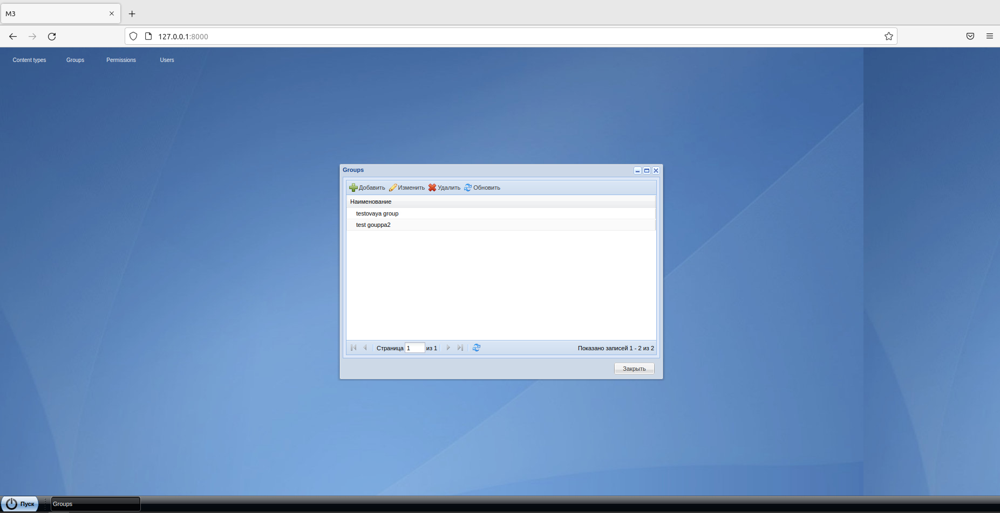
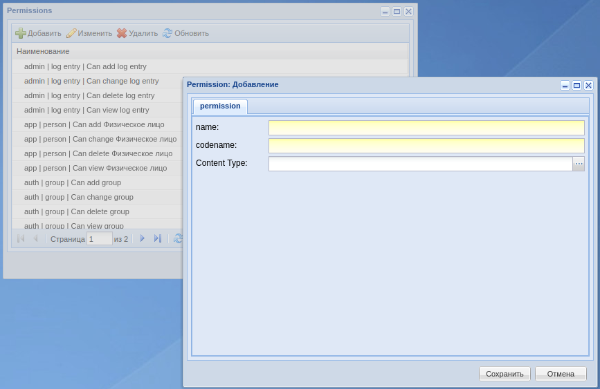
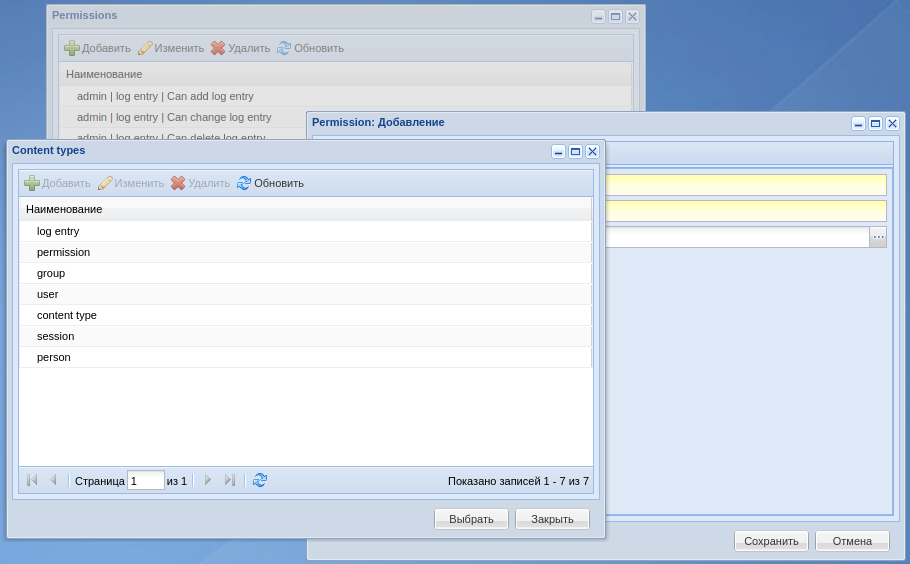
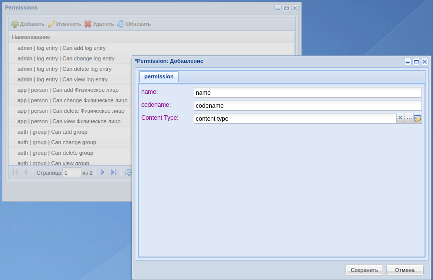
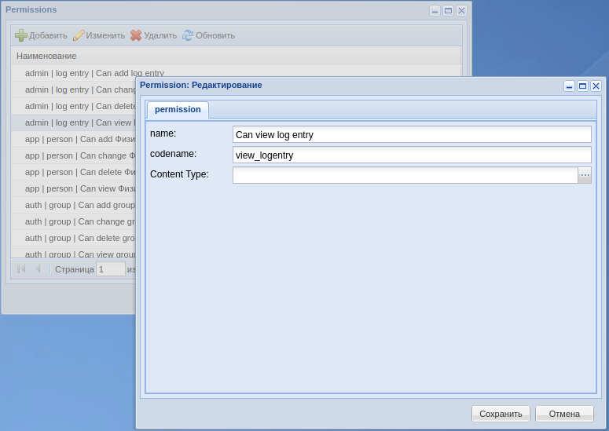

# Testovoe

Выполнил: Добролюбов Антон

Пункты вроде все выполнил, но с таблицей Permission не получилось выводить содержимое поля ContentType.

### Тест работы

Рис. 1 - Генерация setup.py файла

Рис. 2 - Создание виртуального окружения и установка проекта

Рис. 3 - Запуск

### Тест интерфейса

Рис. 4 - Интерфейс приложения

Рис. 5 - Воссозданный интерфейс окна добавления пользователя

Рис. 6 - Редактирование пользователя

Рис. 7 - Создание Permission объекта

Рис. 8 - Список ContentType объектов

Рис. 9 - Заполненный Permission (сохранение выдает ошибку, так как не получилось сохранить содержимое поля ContentType в объект Permission)

Рис. 10 - Редактирование Permission (выбранный ContentType не отображается, сохранение так же выдаст ошибку)
