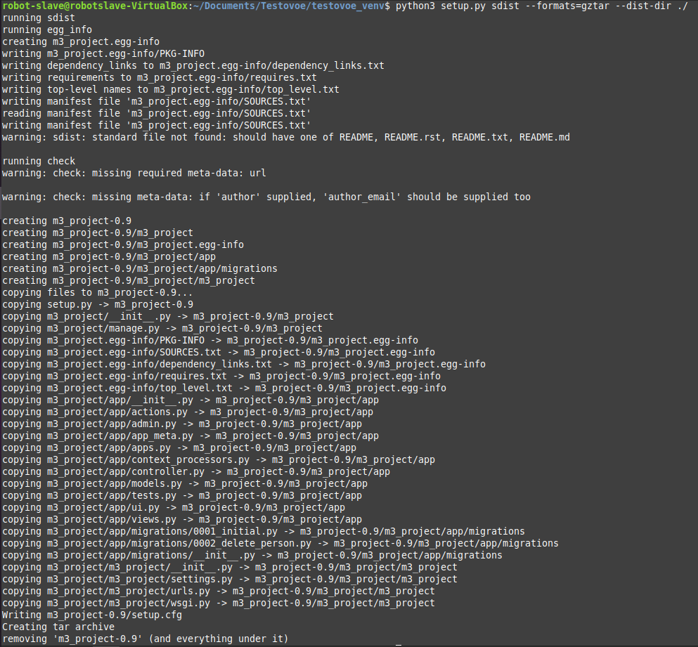
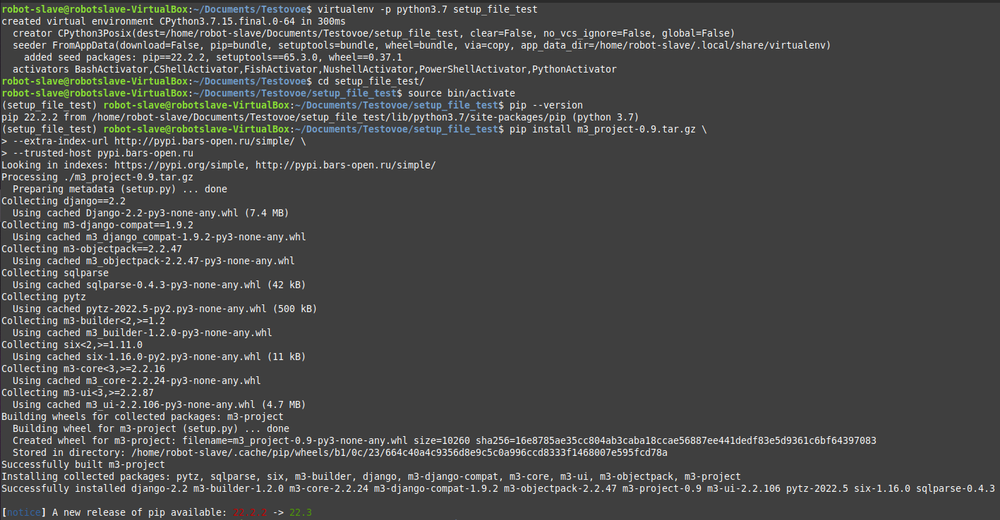
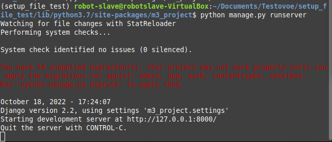
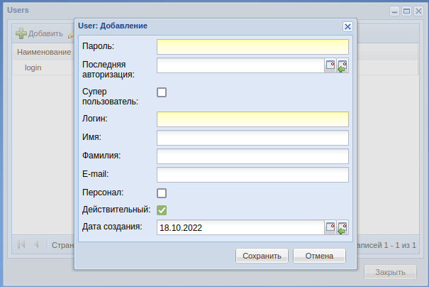
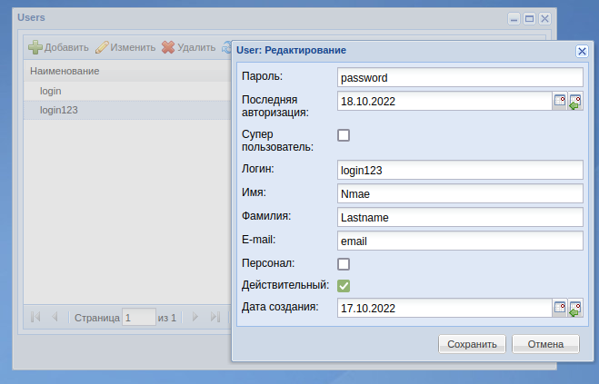

# Testovoe

Выполнил: Добролюбов Антон

### Тест работы

Рис. 1 - Генерация setup.py файла

Рис. 2 - Создание виртуального окружения и установка проекта

Рис. 3 - Запуск

### Тест интерфейса

Рис. 4 - Вручную воссозданный интерфейс окна добавления пользователя

Рис. 5 - Редактирование пользователя

Рис. 6 - Редактирование пользователя
